You don't need to know the graphics-programming term to find the fix. This page is an atlas: describe what you see, match it to an image, get the technical name, the usual cause, and the fix. Headings are written in the words people actually use to report these bugs.

Where a bug is only obvious by contrast, the screenshot is a side-by-side — **correct on the left, broken on the right**, separated by a thin white line.

## "My terrain/decals flicker or have patchy stripes"

**Technical term:** z-fighting (depth fighting, coplanar surface fighting)
**Also reported as:** geometry fighting, shimmering surfaces, flickering textures, two objects fighting, stripes that crawl when the camera moves

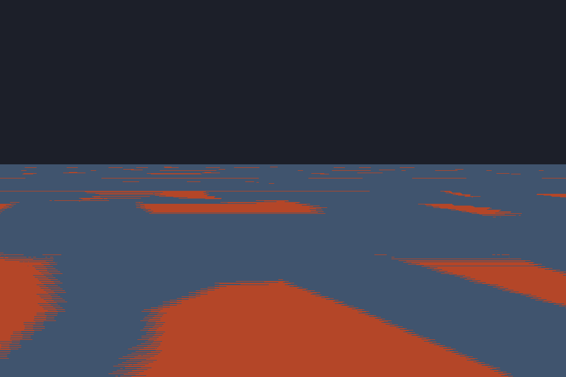

Two surfaces occupy (almost) the same plane. At distance or grazing angles the depth buffer can't tell them apart, so per-pixel it picks a winner — and the winner changes as the camera moves.

**Likely causes:**

- A decal, road, or water plane placed at *exactly* the same height as the surface below it
- Two overlapping static meshes placed in the same spot by a generator or an accidental duplicate
- Near/far planes set too far apart (e.g. `near=0.001, far=50000`), collapsing depth precision

**Fix:** offset coplanar surfaces by a visible amount (don't rely on `0.001`-scale epsilon at long distances), tighten your near/far range — pushing `near` out is far more effective than pulling `far` in — and delete duplicate geometry.

## "My model is inside-out / has holes / I can see through it"

**Technical term:** inverted winding order / back-face culling
**Also reported as:** missing faces, see-through mesh, walls you can walk behind, inside-out geometry

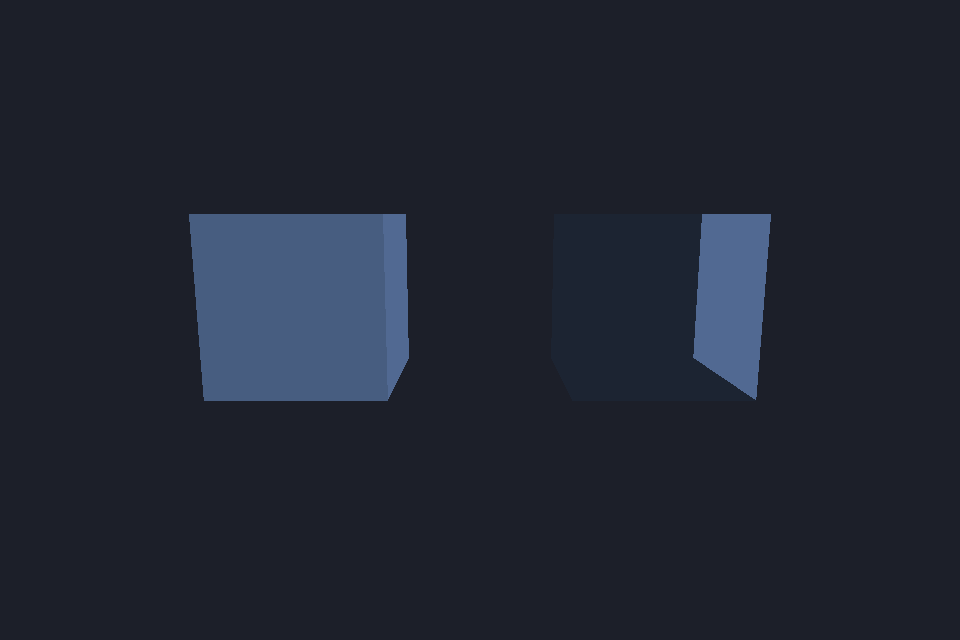

Triangles have a front and a back; the renderer culls the back for speed. If a mesh's triangle order is inverted (or it was exported with a negative scale / mirrored transform), the "outside" faces get culled and you stare into the interior.

**Likely causes:**

- Negative scale on a transform (`scale.x = -1` mirrors winding)
- Bad import/export winding convention (left- vs right-handed conversion)
- Procedural mesh built with indices in the wrong order

**Fix:** reverse each triangle's index order, flip the mirroring axis instead of negating scale, or — for one-off geometry — set the material's `cullMode` to `"none"` (double-sided) at a small rendering cost.

## "My model renders completely black"

**Technical term:** missing / degenerate normals
**Also reported as:** model has no lighting, mesh is pitch black, flat dark silhouette

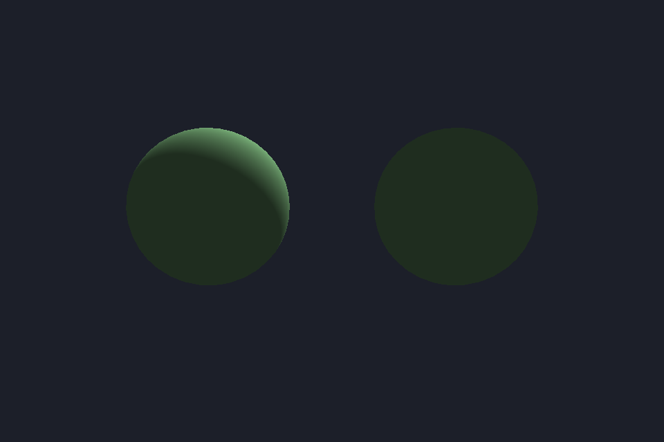

Lighting is computed from surface normals. If the normals are zero, missing, or all point the wrong way, every lighting term collapses and you get a flat dark shape — even in a fully lit scene.

**Likely causes:**

- Mesh imported without a normal attribute
- Procedural geometry that never computed normals
- A vertex-layout bug reading positions *as* normals (see "exploded mesh" below — the two often travel together)

**Fix:** re-export with normals, or generate them (`MeshBuilder` computes normals for procedural meshes). If the model is lit *inside-out* — bright where it should be dark — the normals are inverted, not missing.

## "My mesh exploded into random triangles"

**Technical term:** vertex buffer layout mismatch (or garbage index buffer)
**Also reported as:** stretchy triangles, spiky mess, geometry pinned to the origin, corrupted model

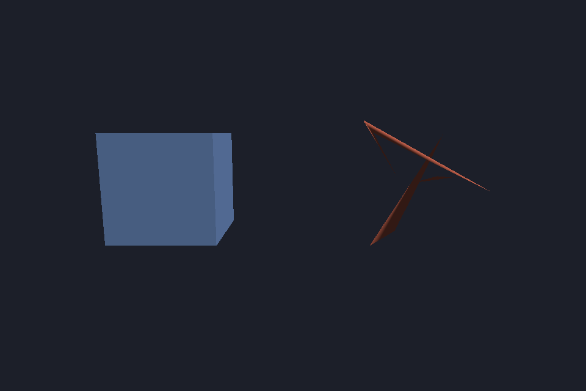

The GPU is reading vertex data with the wrong stride/offsets — positions land on normals, normals land on uvs — or the index buffer references garbage. Some vertices collapse to the origin while others stay plausible, producing the signature "spiky starfish" look.

**Likely causes:**

- Vertex attribute declaration (stride/offset/format) doesn't match the actual buffer layout
- Index buffer uploaded to a position buffer's slot, or an interleaved buffer read as packed
- glTF primitive attributes uploaded in the wrong order

**Fix:** check the pipeline's vertex buffer layout against how the buffer was filled. If half the mesh looks right and half is pinned at the origin, the stride is almost certainly wrong.

## "My character is stretched into spikes / a spaghetti monster"

**Technical term:** skinning / bind-pose mismatch (wrong joint palette)
**Also reported as:** skeleton mesh mismatch, exploding rig, vertices flying off, T-pose with stretched limbs

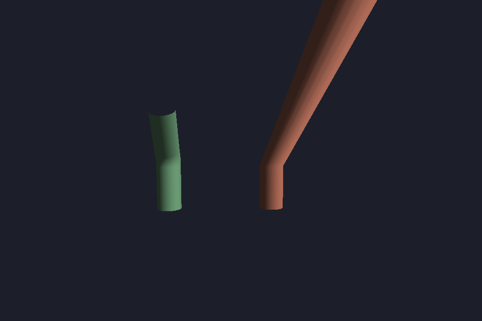

Each vertex is dragged by its bones' matrices. If the joint palette is wrong — wrong ordering, stale buffer, bind matrices not applied — vertices get flung to wherever the bogus transforms point, producing kilometer-long streaks.

**Likely causes:**

- Bone palette uploaded in the wrong order, or mapped by index instead of by name
- Missing inverse-bind matrices, so skinning happens in the wrong space
- A skeleton/mesh pair from different assets (the classic "skeleton and mesh don't match")
- Animation clip playing on a rig whose bone names don't match (Mixamo `mixamorig:` prefixes are a common culprit — see the [Animation guide](/guides/animation))

**Fix:** verify the joint indices in the mesh match the palette order, confirm inverse-bind matrices are applied, and diff bone names between the clip and the skeleton.

## "Transparent surfaces have holes or vanish where they overlap"

**Technical term:** transparency sorting / depth writes in the transparent pass
**Also reported as:** glass cuts off objects behind it, water has rectangular holes, particles clip each other, see-through objects look wrong

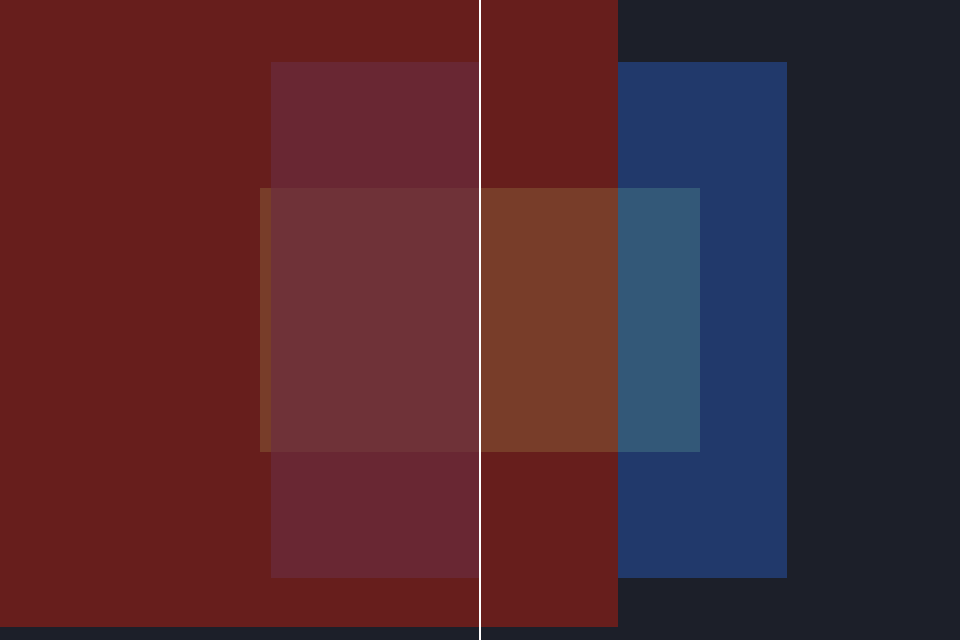

Transparent surfaces that write to the depth buffer occlude other transparent surfaces drawn after them. When draw order isn't back-to-front, a nearer transparent surface "punches a hole" in whatever is behind it.

**Likely causes:**

- A transparent material with `depthWriteEnabled: true`
- Custom transparent geometry rendered in the opaque pass instead of the engine's transparent pass (which sorts back-to-front — see the [Render Pipeline docs](/architecture/render-pipeline))
- Two transparent objects at the same depth sorting ambiguously

**Fix:** disable depth writes on transparent materials, and render translucents in the transparent pass rather than the opaque pass. If two transparent surfaces must interpenetrate, no simple sort order will fix it — that needs alpha-hashing or order-independent transparency.

## "I can see objects through walls"

**Technical term:** missing depth test / draw-order bug
**Also reported as:** enemy visible through wall, wallhack, things on top that should be behind, render order wrong

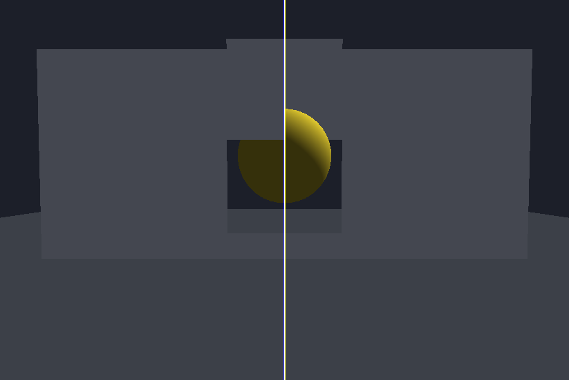

The object is being drawn *after* the occluder with depth testing disabled (or in a later pass that ignores the depth buffer), so it always wins per-pixel.

**Likely causes:**

- Depth test disabled / `depthCompare: "always"` on the object's pipeline
- The object renders in a post/UI pass that clears or ignores depth
- The occluder never wrote depth (transparent material, depth prepass skipped)

**Fix:** restore depth testing on the object's material, and make sure occluding geometry is opaque or writes depth in the prepass.

## "My edges are jagged / stair-stepped"

**Technical term:** aliasing (missing MSAA / anti-aliasing)
**Also reported as:** jaggies, rough edges, pixelated lines, staircase edges

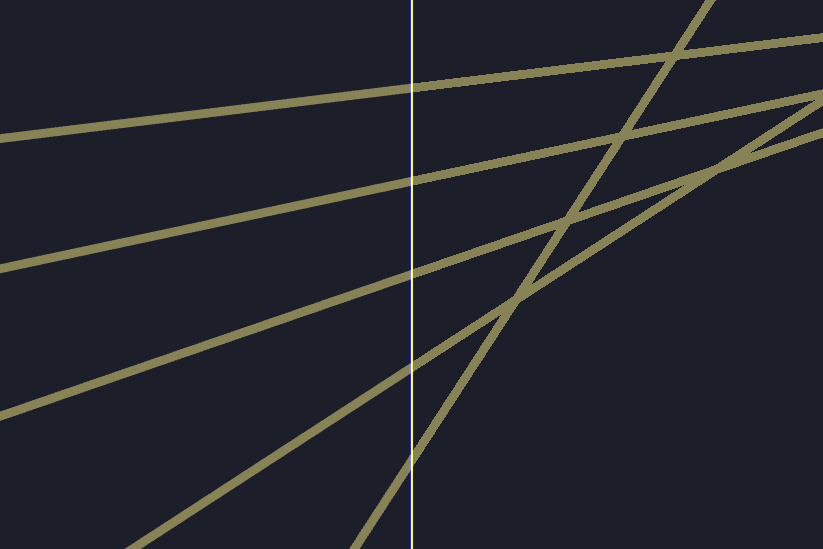

Hard geometry edges resolve to whole pixels. At 1× sampling every diagonal stair-steps — most visible on thin, bright, high-contrast edges.

**Fix:** enable MSAA on the renderer's color target, or add a post-process AA pass (FXAA/TAA-style) in the postfx chain. Aliasing that only appears on textures is a different issue — check mipmap generation instead.

## "Everything looks stretched / squashed"

**Technical term:** aspect ratio mismatch
**Also reported as:** game looks squashed, circles are ellipses, wrong aspect, stretched after window resize

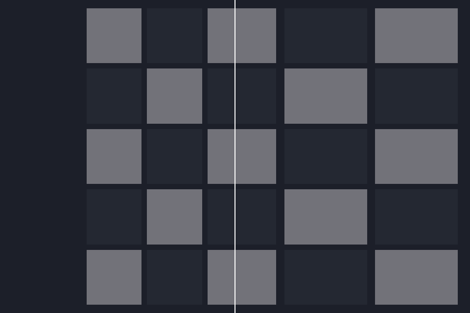

The projection matrix was built with an aspect ratio that doesn't match the surface — commonly after a window resize that never updated the camera.

**Fix:** recompute the projection on resize (`surface.width / surface.height`, not the requested window size — the native surface can come up at a different size than asked). If it only happens on one monitor, check DPI scale factors.

## "My texture is smeared / stretched"

**Technical term:** UV mapping error
**Also reported as:** texture looks stretched, blurry streaks, texture only shows one line of pixels

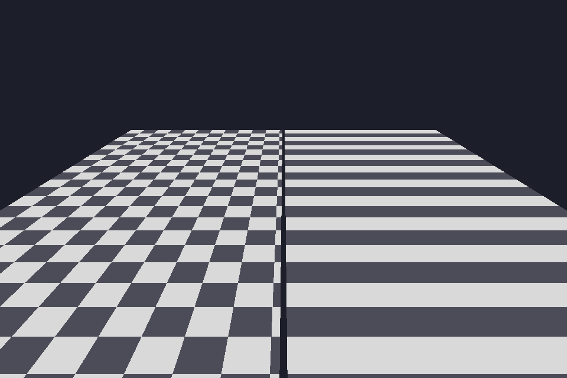

The UV coordinates fed to the sampler don't match the texture — scaled on one axis, offset, or reading the wrong attribute entirely (e.g. `uv2` bound where `uv0` is expected).

**Likely causes:**

- UV scale/tiling set wrong on the material
- glTF primitives whose second UV set was dropped on import
- Vertex layout bug binding the wrong attribute as UV (see "exploded mesh")

**Fix:** check `uv` attribute binding and the material's tiling parameters. If the smear follows one axis only, look at your UV generation for procedural meshes.

## "My model is hot pink / magenta"

**Technical term:** missing texture fallback
**Also reported as:** pink textures, magenta checkerboard, purple material

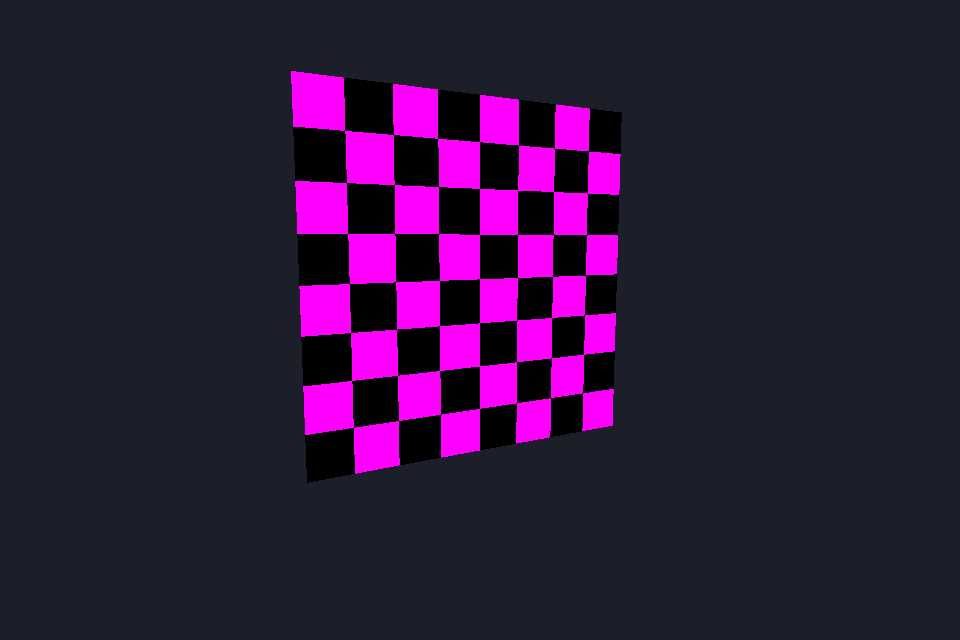

Magenta (often checkered with black) is the universal "texture failed to load" stand-in — chosen because it's impossible to mistake for a real material.

**Likely causes:**

- Texture file path wrong, or the asset wasn't staged into `dd-assets/` at packaging time
- Async load still in flight (transient — should resolve in a frame or two)
- Format the decoder rejected (check the console for asset-load errors)

**Fix:** check the console for the failed URL, verify the path resolves, and confirm the file is included in the packaged assets.

## "Geometry gets sliced or disappears up close"

**Technical term:** near/far plane clipping
**Also reported as:** model vanishes when I get close, clipped geometry, things pop out at a distance, hollow cross-section

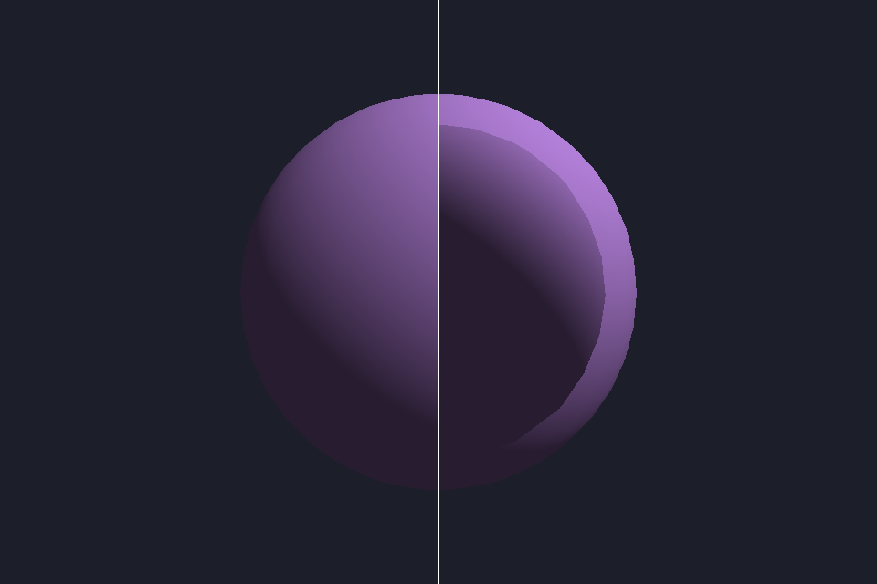

Anything closer than the near plane (or beyond the far plane) is clipped. A too-far near plane visibly slices objects you approach; a too-near far plane makes distant geometry pop out.

**Fix:** pull `near` in — but not too far: near/far ratio controls depth precision, and `near=0.001` buys you z-fighting everywhere else (see the first entry). `0.05`–`0.1` is a sane default for meter-scale scenes.

## "My colors look too dark / washed out"

**Technical term:** gamma / sRGB mismatch (double gamma correction)
**Also reported as:** colors look wrong, everything too dark, washed out textures, banding in gradients

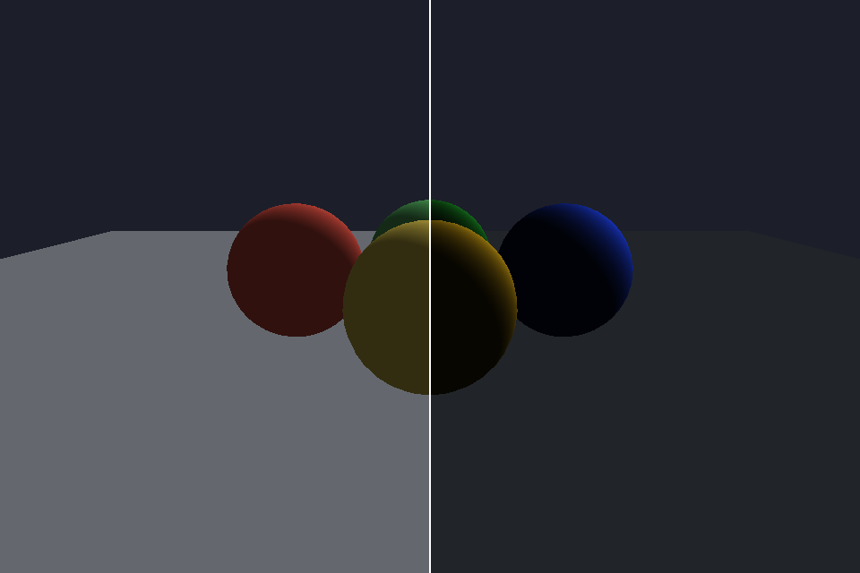

Color gets gamma-corrected twice (or not at all): textures already in sRGB treated as linear and re-encoded, or vice versa. Double gamma crushes darks and oversaturates; skipped gamma washes everything out.

**Fix:** check that texture formats match how the shader consumes them — `rgba8unorm-srgb` vs `rgba8unorm` — and that the final pass doesn't apply a second encode. If the swapchain format ends in `-srgb`, don't encode in the shader too.

## "My shadows have moiré stripes / banding"

**Technical term:** shadow acne (insufficient depth bias)
**Also reported as:** striped shadows, surfaces half-shadowing themselves, shimmering dark bands

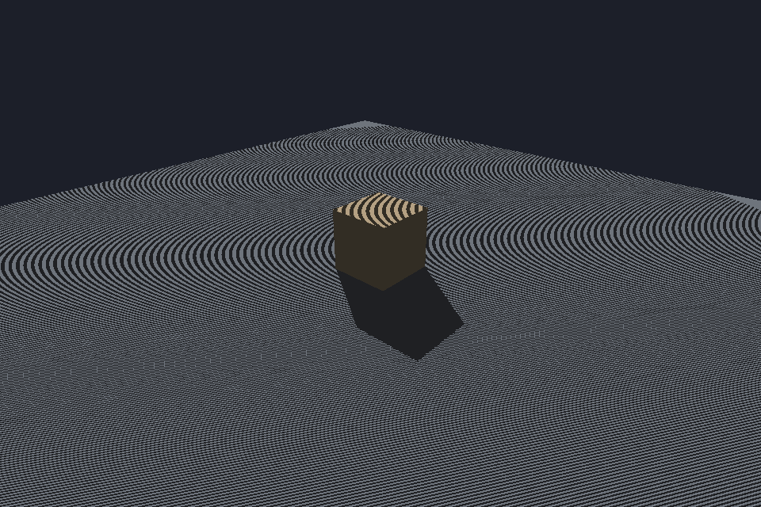

A surface tests its *own* depth in the shadow map and loses by a rounding error, so it randomly shadows itself — the signature moiré/striped pattern.

**Fix:** add a small depth bias (and/or normal-offset bias, which scales better on slopes) to the shadow comparison. Increase it until the stripes disappear — then stop, because past that point you get the next bug…

## "My shadows float / detach from objects"

**Technical term:** peter-panning (excessive depth bias)
**Also reported as:** floating shadows, shadow gap, objects look like they're hovering, shadow detached from feet

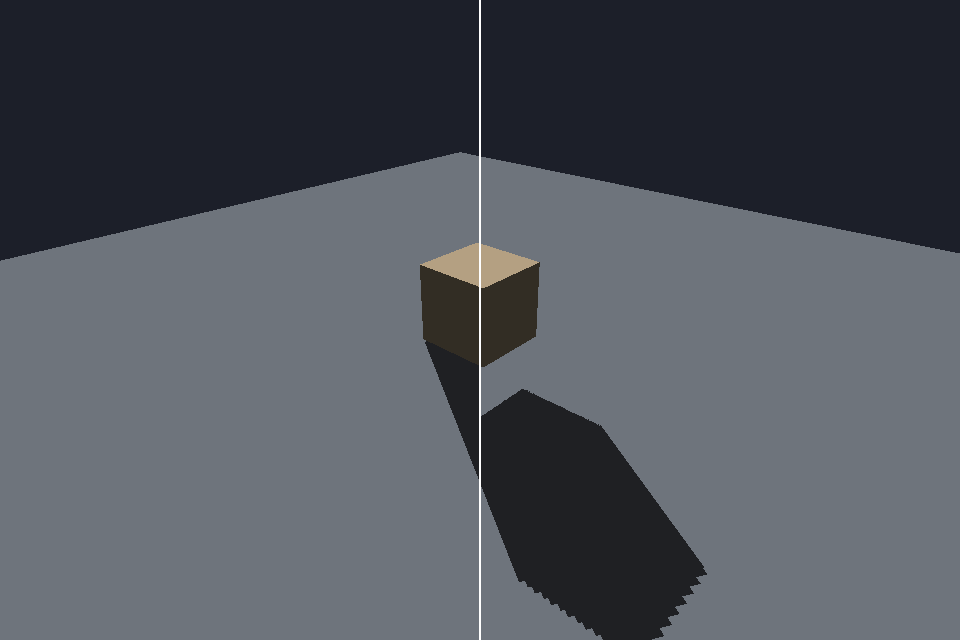

The other end of the bias dial: too much bias erases the shadow near the contact point, so the caster looks airborne and characters lose their grounding.

**Fix:** reduce shadow bias — there's a sweet spot between acne and panning. Normal-offset bias usually lets you use a smaller depth bias for the same effect.

